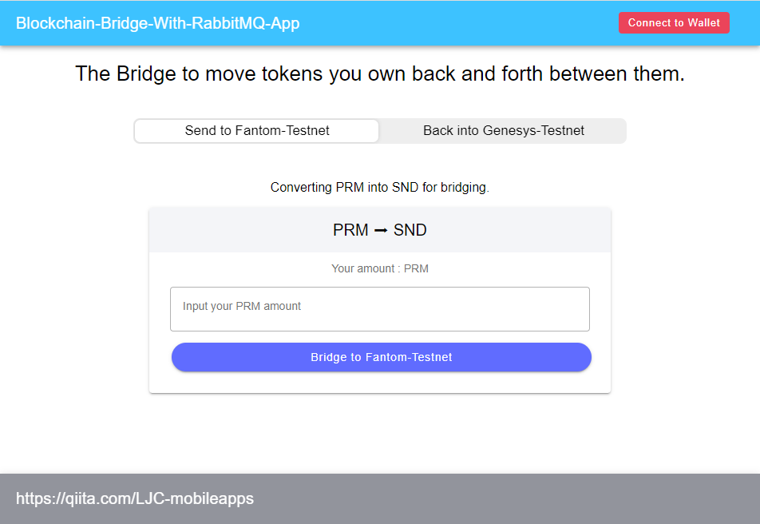

# Blockchain Bridge RabbidMQ App Example

Our user-friendly blockchain bridge app allows you to seamlessly exchange tokens between Source and Destination tokens. This straightforward application facilitates the connection of tokens across different blockchain networks, ensuring a quick and secure token swapping experience. It monitors events on the backend, handles events from smart contracts, and integrates them with RabbitMQ.

## Key Features

* Simple Interface: An intuitive design that allows anyone to exchange tokens effortlessly.
* Swift Transactions: Complete Source token and Dest token transactions in secondarys through the blockchain bridge.
* Emphasis on Security: Employing the latest security protocols to safeguard your assets.
* Transparent Transactions: Real-time tracking of transaction history and status.

## App sources
* Smart contract ( ERC20 based Primary and Secondary Token.)
* Backend java script (With RabbitMQ on the backend.)
* Frontend type script (Ionic Ver7/Angular Ver16)

## Environment setup
This application handles smart contract events, and subsequent processing is performed through transaction processing via RabbitMQ's queuing functionality. Therefore, to run RabbitMQ, please download Erlang/OTP and RabbitMQ from the following site:
* Erlang/OTP : https://www.erlang.org/downloads
* RabbitMQ : https://www.rabbitmq.com

## How to build and setup

### 1\. Smart contract  
a. Copy .env.example to .env.
```shell
cd contracts
cp .env.example .env
```
b. Modify the values of each directive in the .env file.
```
PARAM_RPC_PRIMARY_ENDPOINT=https://testnet-rpc.primary******
PARAM_RPC_PRIMARY_ENDPOINT_CHAINID=0000
PARAM_RPC_SECONDARY_ENDPOINT=https://testnet-rpc.secondary*****
PARAM_RPC_SECONDARY_ENDPOIN_CHAINID=0000
PARAM_DEPLOY_PRIVATE_KEY=0xXXXXXXXXXXXXXXXXXXXXXXXXXXXXXXXXXXXXXXXXXXXXXXXXXXXXXXXXXXXXXXXX
PARAM_BRIDGE_WALLET_ADDRESS=0xXXXXXXXXXXXXXXXXXXXXXXXXXXXXXXXXXXXXXXXX
```
To obtain tokens for the chain you are deploying to, you can acquire them from a Faucet, especially when deploying to a testnet.

c. Install dependencies and deploy the contracts.
```shell
cd contracts
npm install
npm run deploy:p
npm run deploy:s
```
Once deployed, note the contract addresses for each token.


### 2\. Backend
a. Copy .env.example to .env.
```shell
cd backend
cp .env.example .env
```
b. Modify the values of each directive in the .env file.
```
// DO NOT INPUT WSS URL. RPC URL ONLY.
PRIMARY_HTTPS_ENDPOINT=
PRIMARY_TOKEN_CONTRACT_ADDRESS=
// DO NOT INPUT WSS URL. RPC URL ONLY.
SECONDARY_HTTPS_ENDPOINT=
SECONDARY_TOKEN_CONTRACT_ADDRESS=
BRIDGE_WALLET_ADDRESS=
BRIDGE_WALLET_PRIVATE_KEY=
PRIMARY_EXPLORER=https://ropsten.etherscan.io/tx/
SECONDARY_EXPLORER=https://explorer.pops.one/
NONE_ADDR_WALLET=0x0000000000000000000000000000000000000000
PRIMARY_QUEUE_STRING=
SECONDARY_QUEUE_STRING=
```
Set queue messages to PRIMARY_QUEUE_STRING and SECONDARY_QUEUE_STRING.

c. Open two terminals and execute the following commands in each:

**Terminal 1:** Start a Node events-producer Service (sender)
```
npm run start:p
```
**Terminal 2:** Start a Node events-consumer Service (receiver)
```
npm run start:c
```

### 3\. Frontend  
a. Copy .env.example to .env.
```shell
cd frontend
cp .env.example .env
```
b. Modify the values of each directive in the .env file.
```
BB=Blockchain-Bridge-With-RabbitMQ-App
BB_PRIMARY_NETWORK_NAME=*******-Testnet
BB_PRIMARY_NETWORK_ID=0xNNNN
BB_PRIMARY_DECIMALS=18
BB_PRIMARY_NETWORK_RPC=https://*******************.network
BB_PRIMARY_NETWORK_BLOCKEXPLORER=https://****************.explorer
BB_SECONDARY_NETWORK_NAME=******-Testnet
BB_SECONDARY_NETWORK_ID=0xNNN
BB_SECONDARY_DECIMALS=18
BB_SECONDARY_NETWORK_RPC=https://rpc.**********************
BB_SECONDARY_NETWORK_BLOCKEXPLORER=https://xxxxxxx.xxxscan.com
BB_PRIMARY_TOKEN_ADDRESS=0xXXXXXXXXXXXXXXXXXXXXXXXXXXXXXXXXXXXXXXXX
BB_PRIMARY_TOKEN_TICKER=XXXXXX
BB_SECONDARY_TOKEN_ADDRESS=0xXXXXXXXXXXXXXXXXXXXXXXXXXXXXXXXXXXXXXXXX
BB_SECONDARY_TOKEN_TICKER=XXXXXX
BB_BRIDGE_WALLET=0xXXXXXXXXXXXXXXXXXXXXXXXXXXXXXXXXXXXXXXXX

```
exp)
Example of Using Fantom Network as the Primary Token.
```
BB_PRIMARY_NETWORK_NAME=Fantom-Testnet  
BB_PRIMARY_NETWORK_ID=0xfa2  
BB_PRIMARY_DECIMALS=18  
BB_PRIMARY_NETWORK_RPC=https://rpc.testnet.fantom.network  
BB_PRIMARY_NETWORK_BLOCKEXPLORER=https://testnet.ftmscan.com
```

c. Start a Web service.
```
npm run start
```
Open your browser and visit http://localhost:4200/.
Of course, please ensure that the backend services (events-consumer.js and events-producer.js) are up and running, and the smart contract has already been deployed.

#### UI/Screen


## Disclaimer
##### The Bridge feature introduced here is very simple. Please use it as a learning tool application.
